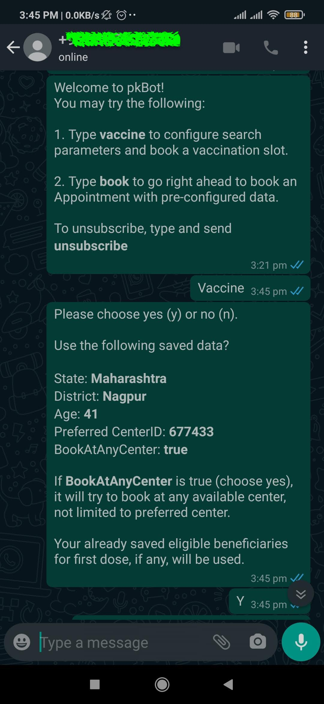

# WhatsApp Bot 
Whatsapp Bot for CoWIN vaccination.


## Install

```
go get github.com/pkjmesra/whatsapp-bot
```

## Usage

```go
go build && go install && mv $GOPATH/bin/whatsapp-bot ./whatsapp-bot
./whatsapp-bot -i 30
```
- i gives the interval to ping and poll for available vaccination slots for a given set of parameters
- m can help setup a specific mobile number for which you'd like to book an appointment via whatsapp

When you run, your mobile/whatsapp will become the host for sending/receiving data with [91MobileNumber].

- On your mobile phone, launch whatsapp and send a "subscribe" message to yourself or ask your friend to send a "subscribe" message to your number. (The same number with which you've logged in into whatsapp-bot)

- Every API call is automated for CoWIN. 
- OTP is sent to your mobile <91MobileNumber>. Enter it in whatsapp when prompted.
- CAPTCHA will be sent on whatsapp itself. Enter CAPTCHA to proceed for appointment.

Entire transaction can be finished in : time taken for OTP + time taken for CAPTCHA.

Enjoy!

- Subscribe to getting notified


- Setting up your search parameters


- Saving your search parameters and confirming



- Receiving your registered beneficiaries


- Receiving the notification when the slots become available


- Trying to book the appointment and receive the confirmation or message if it could not be booked.


```go
package main

import "github.com/pkjmesra/whatsapp-bot/pkWhatsApp"

func main() {
	client := pkWhatsApp.NewClient()

	client.Listen(func(msg pkWhatsApp.Message) {
		if msg.Text == "Hi" {
			client.SendText(msg.From, "Hello from github!")
		}
	})
}
```

After executing `pkWhatsApp.NewClient()` function, app will create a [WhatsApp connection](https://github.com/Rhymen/go-whatsapp). If you are not logged in, it will print a QR code in the terminal. Scan it with your phone and you are ready to go!

> Bot will remember the session so there is no need to authenticate everytime.

